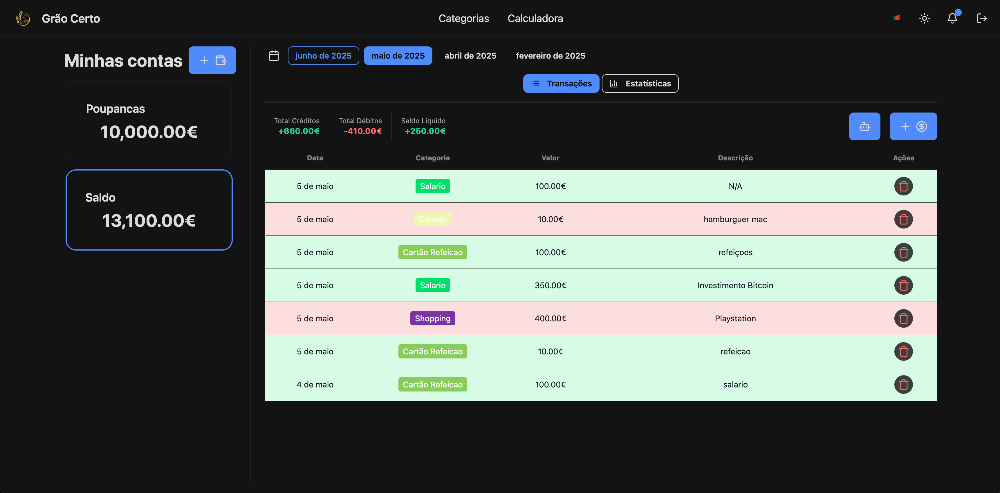
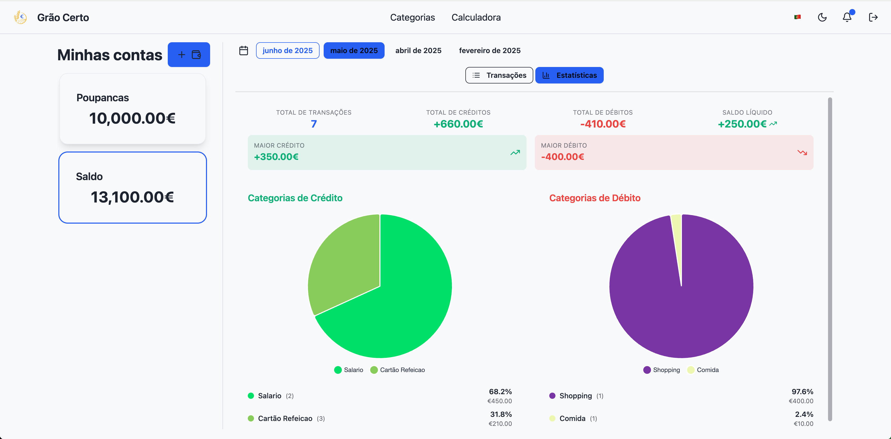
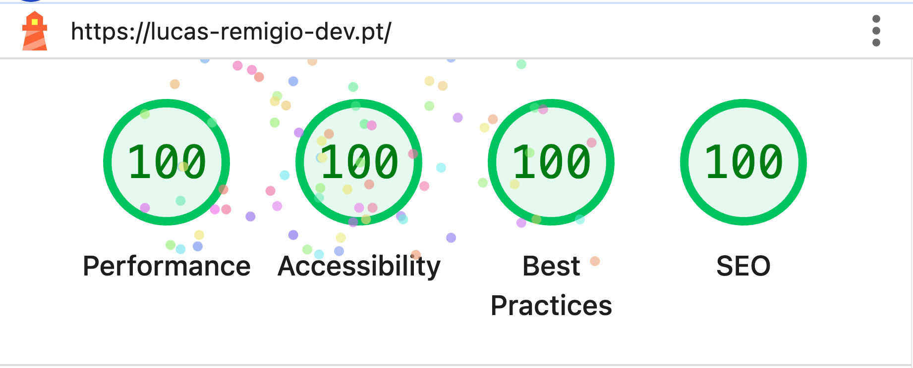

# 💰 Grão Certo - A Modern Full-Stack Financial Management Platform

Portugal faces significant challenges in financial literacy, ranking among the lowest in Europe according to OECD studies. Many Portuguese families struggle with:

- **Low financial awareness** - Limited understanding of personal finance fundamentals
- **Poor spending visibility** - Lack of tools to track where money actually goes
- **Budget management gaps** - Difficulty knowing how much remains at month's end
- **Cultural barriers** - Financial planning not being part of everyday conversations

While numerous expense tracking solutions exist globally, this project tackles the **root cause** with a **Portuguese-first approach**, focusing on being the **fastest**, **most secure**, and **aesthetically pleasing** platform specifically designed for Portuguese users.

**Why Another Expense Tracker?**

- ⚡ **Performance-First**: Sub-second load times and lightning-fast interactions
- 🔒 **Security-Focused**: Enterprise-grade security with JWT authentication and encrypted data
- 🎨 **Modern Design**: Clean, intuitive interface that makes financial tracking enjoyable
- 🇵🇹 **Portuguese-Centric**: Built specifically for Portuguese financial behaviors and cultural context
- 🤝 **Community-Driven**: Open to feature requests and changes to ensure everyone feels comfortable using the platform

Before you can improve your finances, you need to understand your spending patterns, identify cost-cutting opportunities, and gain visibility into your monthly cash flow.

## 📱 Platform Demo

### **Transaction Management** 🌙



### **Financial Insights** ☀️



## 🎯 Project Vision

### 💡 **Social Impact**

- **Financial Education**: Helping Portuguese-speaking communities improve their financial literacy through practical expense tracking
- **Expense Intelligence**: Smart categorization and insights that reveal spending patterns and highlight areas for improvement
- **Accessible Design**: User-friendly interface that makes financial tracking approachable for all education levels
- **Cultural Relevance**: Tailored specifically for Portuguese markets, financial behaviors, and common expense categories
- **Practical Foundation**: Starting with basic expense tracking - the essential first step toward financial awareness

### 🚀 **Technical Excellence & Learning**

- **DevOps Mastery**: Advanced CI/CD pipelines, Docker containerization, and Kubernetes orchestration
- **Performance Focus**: Lightning-fast application built with Go backend and SvelteKit frontend
- **Developer Experience**: Optimized workflows, efficient builds, and modern tooling
- **Production-Ready**: Scalable architecture with proper monitoring and deployment strategies

## 🏗️ Architecture & Tech Stack

### **Backend - Performance First** ⚡

```
🔧 Go 1.23+ (Blazing fast, concurrent)
📊 MySQL (Reliable data persistence)
🔐 JWT Authentication (Secure user sessions)
🤖 OpenAI Integration (Smart expense categorization)
📡 WebSocket Support (Real-time updates)
```

### **Frontend - Modern & Responsive** 🎨

```
⚡ SvelteKit (Minimal bundle, maximum performance)
🎨 TailwindCSS + DaisyUI (Beautiful, consistent design)
📱 Responsive Design (Mobile-friendly approach)
🔄 Real-time Updates (WebSocket integration)
```

### **Infrastructure - DevOps Excellence** 🚀

```
🐳 Docker (Multi-stage builds, optimized images)
🔄 GitHub Actions (Automated CI/CD pipelines)
☁️ VPS Deployment (Cost-effective, scalable)
📊 Database Migrations (Version-controlled schema)
```

## 📊 Performance Metrics

### **Runtime Performance** ⚡

```
API Response Times:
├── Authentication: <150ms
├── Transaction CRUD: <65ms
├── Account Operations: <65ms
└── AI Categorization: <500ms

Frontend Performance:
├── First Contentful Paint: ˜0.4s
├── Largest Contentful Paint: ˜0.5s
├── Perfomance: 100%
├── Acessibility: 100%
├── Best Practices: 100%
```

### **Lighthouse Performance Report** 🎯



## 🤝 Contributing

This project welcomes contributions in both **technical improvements** and **financial education content**. I'm particularly open to **feature requests** and **usability improvements** to ensure everyone feels comfortable using the platform.

### **Community Feedback** 💬

- **Feature Requests**: Suggest new features that would improve your financial tracking experience
- **UI/UX Improvements**: Help make the platform more intuitive and accessible
- **Usability Testing**: Share feedback on what works well and what could be improved
- **Cultural Adaptations**: Suggest Portuguese-specific features or financial categories

### **Technical Contributions** 🔧

- Performance optimizations
- New features and integrations
- Infrastructure improvements
- Documentation and tutorials

### **Content Contributions** 📚

- Portuguese financial education materials
- Expense categorization improvements
- User experience enhancements
- Localization improvements

## 🚀 Quick Start

### **Prerequisites**

```bash
# Required tools
- Docker & Docker Compose
- Go 1.23+
- Node.js 18+
- pnpm
- Make
```

### **Development Setup**

```bash
# Clone the repository
git clone https://github.com/lucas-remigio/wallet-tracker.git
cd wallet-tracker

# Start all services
docker compose up --build

# Access the application
# Frontend: http://localhost:3000
# Backend API: http://localhost:3001
# WebSockets: http://localhost:3002
```
